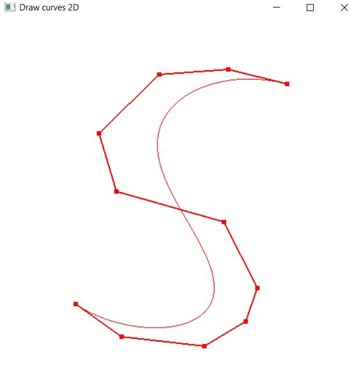
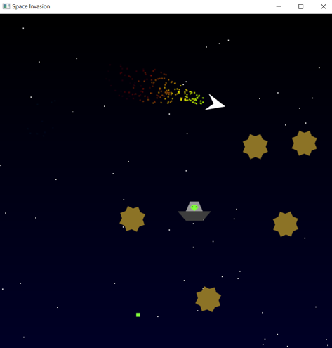
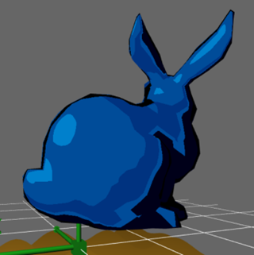
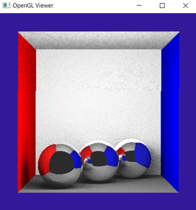
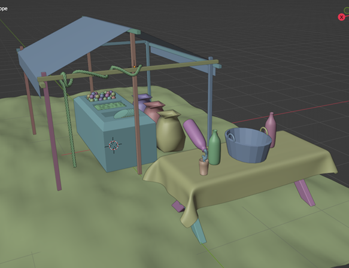
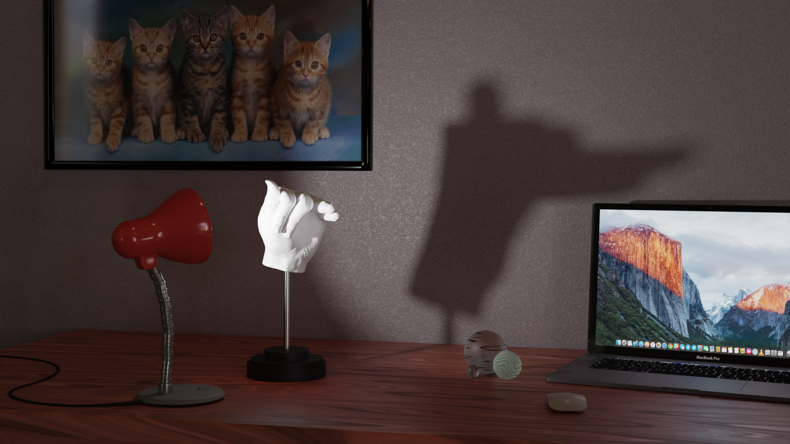
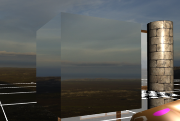

# Collection of Computer Graphics Projects
This repository contains a collection of small projects developed for the Computer Graphics exam at University of Bologna.

## LAB 01
This project contains a c++ application for the construction of different types of Bézier curves. The app uses the library OpenGL.

You can read the report for this project [here](LAB_01/LAB_01_report_MG.pdf) (in Italian).
## LAB 02
This project contains a simple demo game developed in c++ with the OpenGL library.

You can read the report for this project [here](LAB_02/LAB_02_report_MG.pdf) (in Italian).
## LAB 03
This project contains simple demo shaders developed with GLSL.

You can read the report for this project [here](LAB_03/LAB_03_report_MG.pdf) (in Italian).

## LAB 04
This project contains a c++ implementation of ray-tracing, constructed with OpenGL.

You can read the report for this project [here](LAB_03/LAB_03_report_MG.pdf) (in Italian).
## LAB 05
This project contains a simple Blender scene made to showcase different modeling approaches.

You can read the report for this project [here](LAB_03/LAB_03_report_MG.pdf) (in Italian).

## LAB 06
This project contains a Blender render made with both cycle and Eevee to showcase the construction of different materials, shadows and raytracing.

You can read the report for this project [here](LAB_01/LAB_01_report_MG.pdf) (in Italian).
## LAB 07
This project contains a  simple c++ program that uses texturing with OpenGL

You can read the report for this project [here](LAB_01/LAB_01_report_MG.pdf) (in Italian).
